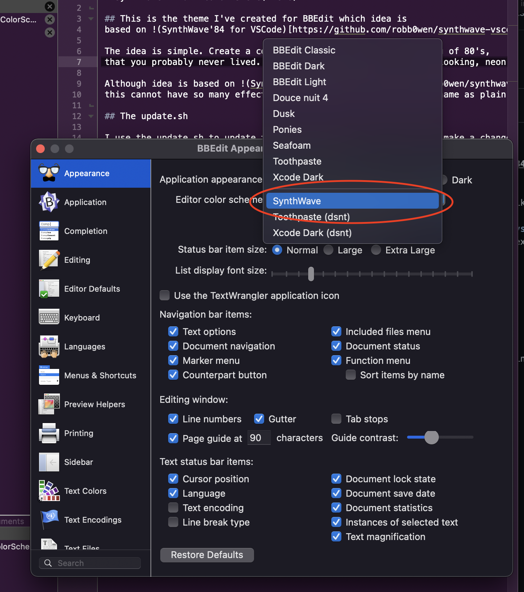

# SynthWave BBEdit Color Sheme(Theme)

## This is the theme I've created for BBEdit which idea is based on [SynthWave'84 for VSCode](https://github.com/robb0wen/synthwave-vscode).

The idea is simple. Create a cool looking theme, that reminds you of 80's,
that you probably never lived. Not shiny, not glossy, just cool looking, neon like.

Although idea is based on [Synthwave'84](https://github.com/robb0wen/synthwave-vscode)
this cannot have so many effects as i.e. BBEdit treats function name as plain text.

## Instalation

Simply copy .bbColorScheme to `~/Library/Applications\ Support/BBEdit/Color\ Schemes/`

Then open preferences (,+cmd) and select theme. 

